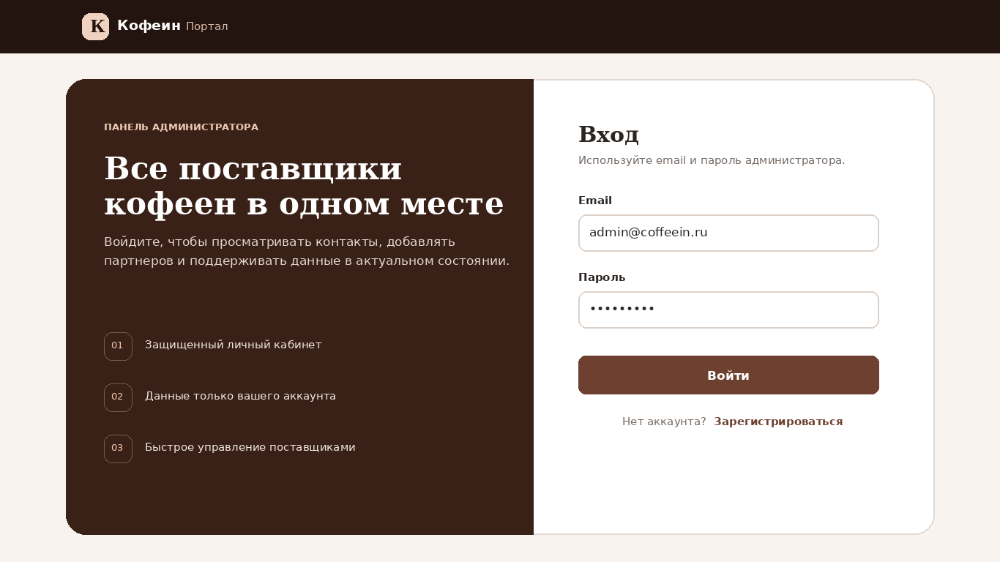
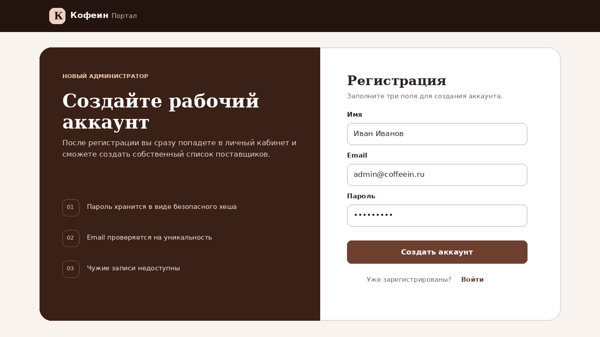
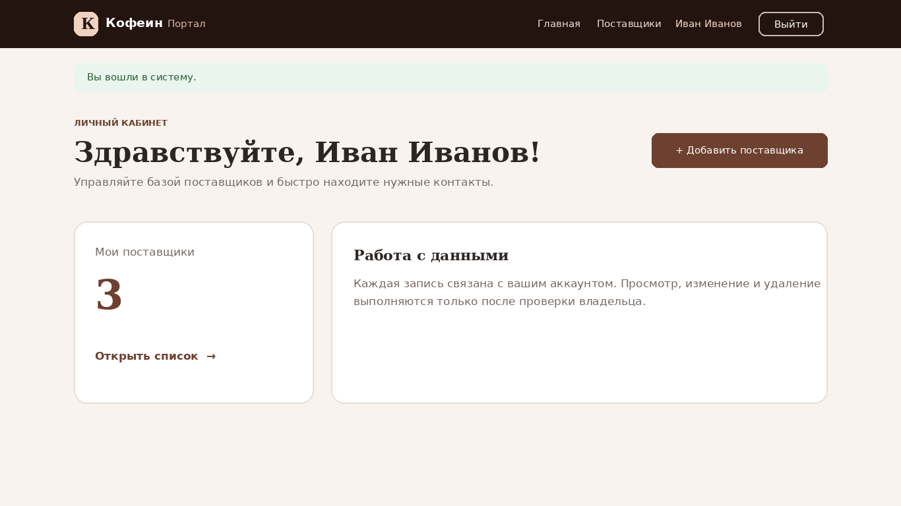
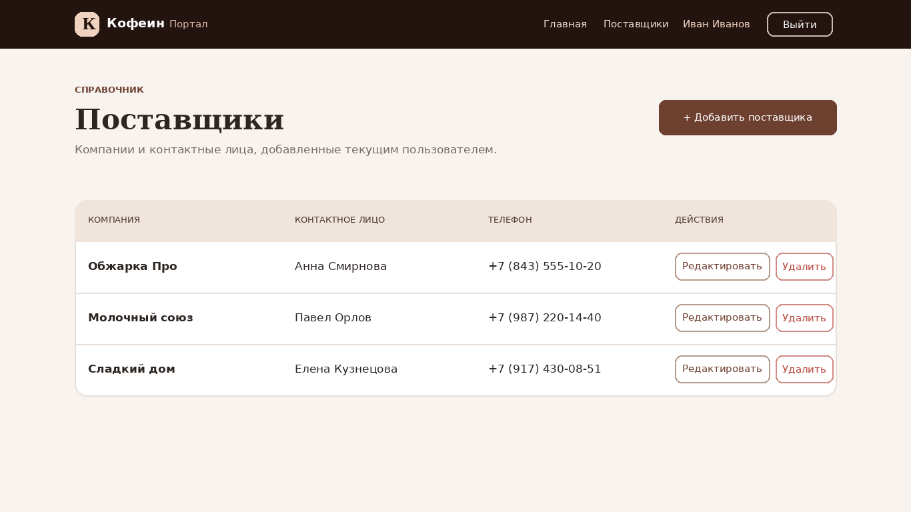
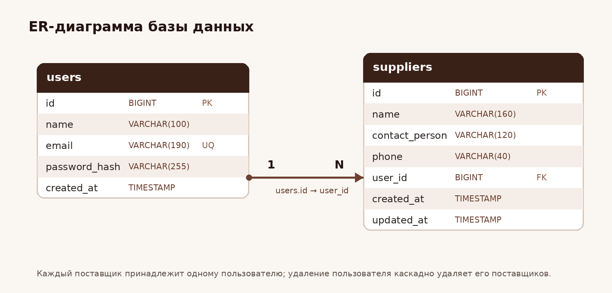

# Кофеин Портал

Учебное веб-приложение для администраторов сети кофеен. Проект выполнен для производственной практики ПП 08 по специальности 09.02.07 «Информационные системы и программирование».

Пользователь может зарегистрироваться, войти в личный кабинет и управлять своим списком поставщиков. Каждый пользователь видит и изменяет только собственные записи.

## Скриншоты

| Вход | Регистрация |
| --- | --- |
|  |  |

| Личный кабинет | Список поставщиков |
| --- | --- |
|  |  |

## Возможности

- регистрация с проверкой имени, email и пароля;
- безопасное хранение паролей через `password_hash`;
- вход, выход и защита закрытых страниц;
- личный кабинет с именем пользователя и количеством поставщиков;
- добавление, просмотр, изменение и удаление поставщиков;
- проверка владельца записи по `user_id`;
- подготовленные PDO-запросы для защиты от SQL-инъекций;
- CSRF-защита форм и Fetch-запроса удаления;
- клиентская проверка форм;
- адаптивный интерфейс на Bootstrap 5, Flexbox и CSS Grid.

## Используемые технологии

- PHP 8.1 или новее;
- MySQL 8.0 или MariaDB 10.5 и новее;
- PDO;
- HTML5 и CSS3;
- Bootstrap 5;
- JavaScript и Fetch API.

## Быстрый запуск

### 1. Создание базы данных

Откройте терминал в каталоге проекта и выполните:

```bash
mysql -u root -p < database/schema.sql
```

Скрипт создаст базу `coffeein` и две таблицы: `users` и `suppliers`.

### 2. Настройка подключения

Скопируйте пример настроек:

```bash
cp .env.example .env
```

Откройте `.env` и укажите имя пользователя и пароль MySQL:

```dotenv
DB_DSN=mysql:host=127.0.0.1;port=3306;dbname=coffeein;charset=utf8mb4
DB_USER=root
DB_PASSWORD=ваш_пароль
```

Файл `.env` добавлен в `.gitignore` и не загружается в GitHub.

### 3. Запуск сервера

```bash
php -S localhost:8000 -t public router.php
```

После запуска откройте [http://localhost:8000/register](http://localhost:8000/register).

## Основные маршруты

| Метод | Адрес | Назначение |
| --- | --- | --- |
| GET, POST | `/register` | регистрация пользователя |
| GET, POST | `/login` | вход в систему |
| POST | `/logout` | выход из системы |
| GET | `/dashboard` | личный кабинет |
| GET | `/suppliers` | список поставщиков |
| GET, POST | `/suppliers/create` | добавление поставщика |
| GET, POST | `/suppliers/edit/{id}` | редактирование поставщика |
| DELETE | `/api/suppliers/{id}` | удаление поставщика через Fetch API |

## Структура проекта

```text
coffeein-portal/
├── database/
│   └── schema.sql
├── docs/
│   ├── er-diagram.png
│   ├── chapter-3-source-code.md
│   └── screenshots/
├── public/
│   ├── assets/
│   │   ├── app.css
│   │   └── app.js
│   └── index.php
├── src/
│   ├── Controllers/
│   ├── Models/
│   ├── Auth.php
│   ├── Csrf.php
│   ├── Database.php
│   ├── Validator.php
│   └── View.php
├── views/
├── .env.example
├── router.php
└── README.md
```

## База данных



- `users` хранит учетные записи пользователей;
- `suppliers` хранит поставщиков;
- `suppliers.user_id` связывает поставщика с владельцем;
- внешний ключ с `ON DELETE CASCADE` удаляет поставщиков вместе с пользователем.

## Безопасность

- пароли сохраняются только в виде хеша;
- после входа идентификатор сессии обновляется;
- SQL-запросы выполняются через подготовленные выражения;
- формы и запрос удаления защищены CSRF-токеном;
- пользовательские данные экранируются перед выводом;
- изменение и удаление выполняются с обязательной проверкой `user_id`.

## Проверка работы

1. Откройте `/dashboard` без входа — приложение должно перенаправить на `/login`.
2. Зарегистрируйте пользователя — откроется личный кабинет.
3. Добавьте поставщика — запись появится в списке.
4. Измените поставщика — новые данные сохранятся.
5. Удалите поставщика — сначала появится подтверждение.
6. Создайте второго пользователя — записи первого пользователя не должны отображаться.

## Материалы главы 3

Краткое объяснение основных файлов и фрагментов программы находится в [docs/chapter-3-source-code.md](docs/chapter-3-source-code.md).
